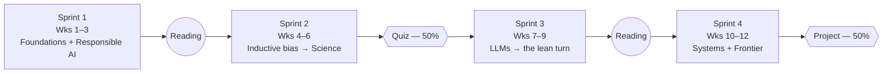

# The Twelve Weeks

How the semester is shaped, week by week, with the reasoning behind the ordering.

## Four sprints

Four three-week sprints, each closed by a reading week. Sprints 2 and 4 close on an assessment week
rather than on new content.

| Sprint | Weeks | Theme | Closes with |
|---|---|---|---|
| 1 | 1–3 | Fast foundations + responsible AI up front | Reading week |
| 2 | 4–6 | Architecture as inductive bias → the science frontier | Week 6 quiz + reading week |
| 3 | 7–9 | LLMs, the limits of scale, and the lean turn | Reading week |
| 4 | 10–12 | Systems, frontier trends, final project | Reading week / submission |

## The weekly rhythm

Every teaching week: **2h live online lecture** + **2h practical lab**, plus asynchronous content
here on Tutors. Reading weeks carry no new content; they exist for consolidation, and twice for
assessment.

## Where each week lives in this course

Each teaching week has its own topic in the Tutors course, following the pattern established by
Week 1: a `unit-01-lecture` holding the slides and reference booklet, and a `unit-02-lab` holding the
lab book and its downloadable files.

| Week | Topic folder | Title |
|---|---|---|
| — | `topic-00-induction` | Induction |
| 1 | `topic-01-shape-of-the-field` | The Shape of the Field |
| 2 | `topic-02-responsible-ai` | Responsible AI, Before We Build Anything |
| 3 | `topic-03-how-machines-learn` | How Machines Learn, Fast |
| 4 | `topic-04-model-families` | Model Families |
| 5 | `topic-05-science-inspired-ai` | Science-Inspired AI |
| 6 | `topic-06-quiz-and-review` | Quiz: Foundations and the Science Frontier |
| 7 | `topic-07-transformers-and-llms` | Transformers and LLMs |
| 8 | `topic-08-scale-free-llms` | Scale-Free LLMs |
| 9 | `topic-09-lean-llms` | Lean LLMs |
| 10 | `topic-10-llms-in-software-engineering` | LLMs in Software Engineering |
| 11 | `topic-11-frontier-trends` | Frontier and Emerging Trends |
| 12 | `topic-12-final-project` | Final Project: Build, Showcase, Reflect |

The four pages that follow walk through the sprints in turn.
