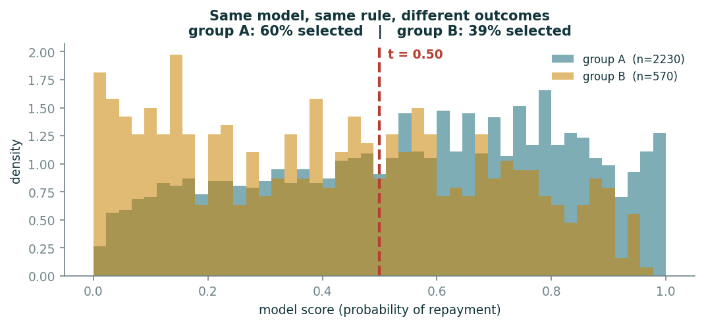

# Step 3 · The model, and the line you draw

*≈ 25 min · lecture: pipeline stages Model → Threshold, "where you cut"*

## What you are doing

A standard, well-built model has already been trained for you. It never saw `group`.
For each applicant it gives a **score** between 0 and 1: how likely they are to repay.
You then choose a **threshold**: approve everyone above the line, refuse everyone below.

The lecture said: **the threshold is one number, and it decides who bears every error.**

Four numbers appear per group:

| number | meaning |
|---|---|
| approval rate | share of the group that gets a loan |
| accuracy | share of decisions that were right |
| TPR | share of *good* borrowers who were (correctly) approved |
| FPR | share of *bad* borrowers who were (wrongly) approved |

## Run this

```python
h.try_threshold(lab, 0.5)
```

## What you should see

```
threshold 0.50   approval rate overall 55.4%   gap in approval rate between groups 0.203

group     n   approval rate   accuracy   TPR    FPR
A      2230           0.596      0.706  0.776  0.378
B       570           0.393      0.668  0.570  0.255
```

Group A is approved about **60%** of the time, group B about **39%**: a gap of **twenty
points** between two groups that are equally able to repay. Good borrowers in A are
approved 78% of the time; in B, 57%.

Now the picture:

```python
ex.fig_distributions(lab["y"], lab["scores"], lab["group"], 0.5); plt.show()
```



Group B's hill sits to the **left**, so the same line cuts off more of B. Nothing about
the model is "wrong"; it learned the manufactured data faithfully.

## Move the line

Change the number and run again. Try `0.3`, `0.4`, `0.6`:

```python
h.try_threshold(lab, 0.4)
```

## The "perfectly fair" line that helps nobody

```python
h.find_equal_approval_threshold(lab)
```

```
threshold   gap in approval rate   approval rate overall   accuracy
     0.98                  0.024                   0.019      0.489
     0.02                  0.032                   0.990      0.532
```

The gap only disappears at thresholds that approve **2%** of everyone, or **99%** of
everyone. The gap is "fair" because almost nobody, or almost everybody, gets a loan.
**A fairness number quoted without the approval rate is meaningless.**

## Check these against `SUBMISSION.md`, Step 3

- **3a.** At threshold 0.5: approval rate for A, for B, and the gap.
- **3b.** One other threshold you tried: its gap and its overall approval rate.
- **3c.** At the threshold with the smallest gap (0.98), what share of people get a loan?
- **3d.** One sentence: why must a fairness number always be reported **together with**
  the approval rate?

That is Step 3 done.
