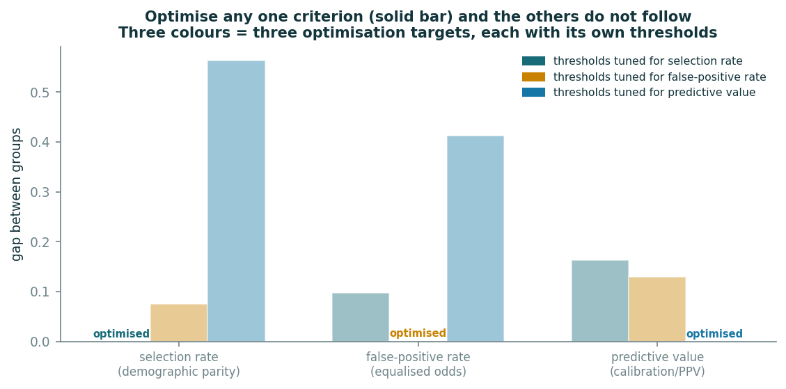

# Going Further (optional)

Everything here is for people who finished the five steps and want more. Each is one cell
in the notebook.

## A. Which mechanism did the damage?

```python
h.mechanism_table()
```

| mechanism switched on | gap in approval rate | gap in TPR | accuracy |
|---|---|---|---|
| none (clean data) | 0.003 | 0.013 | 0.693 |
| sampling_bias | 0.005 | 0.011 | 0.686 |
| historical_bias | **0.148** | 0.156 | 0.674 |
| proxy | 0.004 | 0.018 | 0.693 |
| label_bias | 0.018 | 0.035 | **0.662** |
| all four | 0.203 | 0.205 | 0.699 |

Historical disadvantage alone produces most of the gap. Biased labels alone hurt
*accuracy* most. The proxy alone does nothing, until another mechanism gives it something
to leak. Different mechanisms hurt different metrics; that is why the lecture's pipeline
has seven stops, not one.

## B. The impossibility table

```python
fig, table = ex.fig_impossibility(lab["y"], lab["scores"], lab["group"]); plt.show()
table.round(3)
```



Each row tunes per-group thresholds to zero **one** gap. The other gaps do not follow.
No row zeroes all three, because no such thresholds exist.

## C. Explain one refused applicant

```python
import explain
from datasets import FEATURES
refused = lab["test"][(lab["scores"] < 0.4) & (lab["test"].group == "B")].index[0]
local = explain.lime_from_scratch(lab["model"], lab["train"][FEATURES], lab["test"].loc[refused, FEATURES])
explain.fig_local_explanation(local); plt.show()
```

An explanation tells you what the model **used**. It does not tell you whether it
**should** have. `postcode_score` barely appears, yet Step 2 showed it carries the group.

## D. A simpler model

```python
pd.concat([h.worst_group_accuracy(lab, "gbm"), h.worst_group_accuracy(lab, "logreg")])
```

Compare accuracy **per group**, not the headline. The Week 9 preview.

## E. The full templates

`model_card_template_full.md` (Mitchell et al.) and `datasheet_template.md` (Gebru et
al.) are the blank professional long forms. The completed short `model_card.md` and
`datasheet.md` in the folder are the format the Week 12 project uses.
