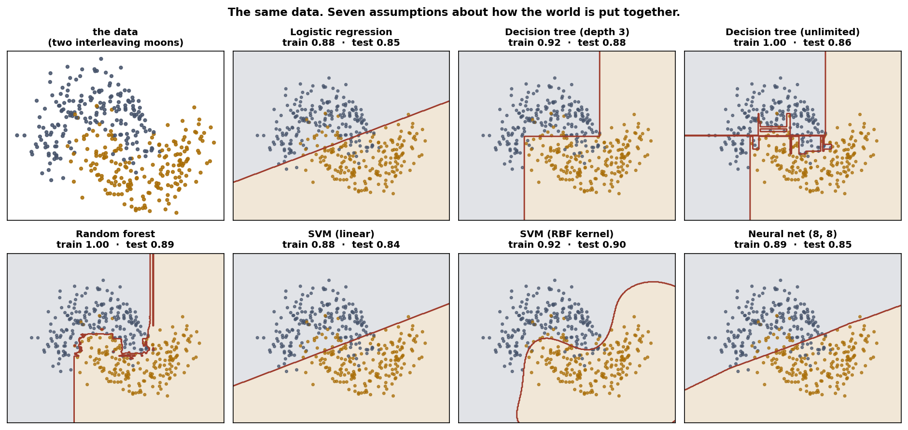

# Exercise 2 · Four shapes of model

*≈ 20 min · lecture Part 2, slides 12 to 19 · Live demo 1*

## From the lecture

> **Red box 2:** *Four shapes: straight line (logistic regression), right-angled steps (tree),
> widest corridor (SVM), many small bends (neural net). Choosing a model is choosing an
> assumption about the shape of the answer.*

## What you are doing

Slide 13 showed the same dots with four different boundaries. This is Live demo 1: seven models
on the same dots, one table with the shape each one draws, plus the picture.

## Run this

```python
ls.four_shapes()
```

## What you should see

```
                    model           shape it draws  train  test   gap
      Logistic regression        one straight line  0.879 0.852 0.027
  Decision tree (depth 3)       right-angled steps  0.915 0.876 0.039
Decision tree (unlimited)       right-angled steps  1.000 0.857 0.143
            Random forest many staircases averaged  1.000 0.890 0.110
             SVM (linear)        one straight line  0.885 0.843 0.042
         SVM (RBF kernel)      a curve (bent page)  0.915 0.895 0.020
        Neural net (8, 8)         many small bends  0.887 0.848 0.040
```

Then the picture:

```python
classical.fig_boundaries(); plt.show()
```



Straight lines from logistic regression and the linear SVM; staircases from the trees; curves
from the RBF SVM and the network.

## Check these against `SUBMISSION.md`, Exercise 2

- **2a.** Highest **test** score. *Where to look: Table A, column `test`.*
- **2b.** The two straight-line models. *Where to look: Table A, column `shape it draws`.*
- **2c.** The shape a tree draws, and why. *Where to look: the picture; slide 15, one question at a time.*
- **2d.** What "choosing a model is choosing an assumption" means. *Where to look: the shape column.*
