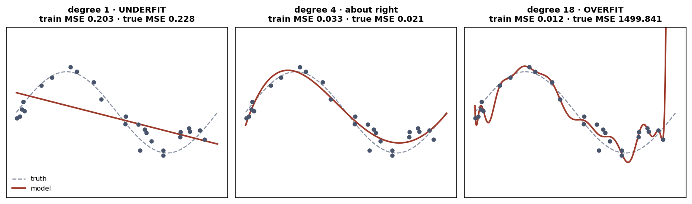

# Exercise 3 · Memorising is not learning

*≈ 20 min · lecture Part 3, slides 20 to 23*

## From the lecture

> **Red box 3:** *Underfitting: too simple, bad on training and new data. Overfitting: memorised
> the training data, great on training, bad on new. You spot it by the gap. Never report training
> accuracy on its own.*

## What you are doing

Slide 15 let a tree keep asking questions until every box held one dot. Here you allow 1, 2, 3, 5,
8 and then unlimited questions and watch the gap open. Then slide 22's diagnosis, then slide 21's
three curves.

## Run this

```python
ls.tree_depth_sweep()
```

## What you should see

```
max questions (depth)  leaves  train  test   gap
                    1       2  0.823 0.771 0.052
                    2       4  0.915 0.876 0.039
                    3       6  0.915 0.876 0.039
                    5      14  0.951 0.890 0.061
                    8      31  0.987 0.871 0.116
            unlimited      38  1.000 0.857 0.143
```

Train climbs to 1.000. Test peaks at depth 5 and falls. The gap opens.

```python
ls.the_gap()                     # slide 22: the two rows that matter
```

```python
fig, fit_table = classical.fig_fit(); plt.show(); fit_table
```



## Check these against `SUBMISSION.md`, Exercise 3

- **3a.** The depth with the highest **test** score. *Where to look: Table A, column `test`.*
- **3b.** The gap for the unlimited tree. *Where to look: Table A, last row, or Printout B.*
- **3c.** Why 1.000 on training is a warning. *Where to look: Printout B.*
- **3d.** Which curve underfits and which overfits. *Where to look: the fit picture and its table.*
