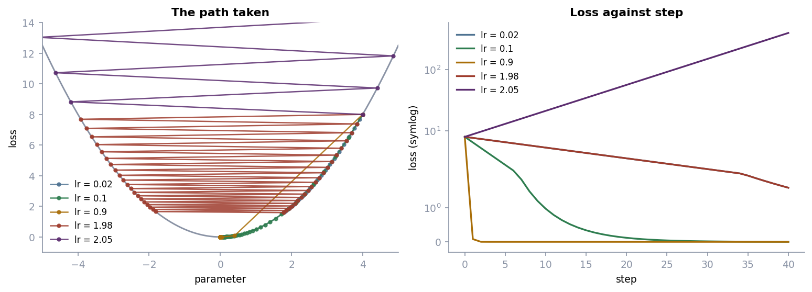

# Exercise 4 · Walking downhill

*≈ 20 min · lecture Part 4, slides 24 to 30 · Live demo 2*

## From the lecture

> **Red box 4:** *Gradient descent: feel the slope, take a small step downhill, repeat.
> new dial = old dial − step size × slope. The step size is the learning rate: too small crawls,
> too big bounces, far too big explodes to `nan` with no error message. A local minimum is a
> small dip that is not the true bottom.*

## What you are doing

Slide 25 walked one dial down a bowl, one step per click. Here is that walk as a table. Then the
five step sizes from slides 27 and 28, then your own, then the bumpy hill from slide 29.

## Run this

```python
ls.walk()                        # slide 25: start at 4.2, step size 0.25, eight steps
```

```
 step  dial (x)  loss (height)  slope under your feet  step length
    0     4.200          8.820                  4.200        1.050
    1     3.150          4.961                  3.150        0.788
    2     2.363          2.791                  2.363        0.591
    3     1.772          1.570                  1.772        0.443
    ...
```

Each step length is 0.25 × the slope, so the steps shrink on their own.

```python
ls.step_sizes()                  # slides 27 and 28
```



```
  lr  final_x  final_loss  verdict
0.02   1.7828      1.5892  crawling: still descending when the budget ran out
0.10   0.0591      0.0017  converged smoothly
0.90   0.0000      0.0000  converged smoothly
1.98   1.7828      1.5892  crawling, and oscillating
2.05  28.1600    396.4915  DIVERGING: every step overshoots further than the last
```

```python
ls.try_lr(1.5)                   # change the number: 1.9, 1.99, 2.0, 2.01
ls.bumpy_hill()                  # slide 29: three starts, one wrong dip
```

## Check these against `SUBMISSION.md`, Exercise 4

- **4a.** The first three step lengths. *Where to look: Table A, column `step length`.*
- **4b.** One word per learning rate. *Where to look: Table B, column `verdict`.*
- **4c.** Where `try_lr` flips to DIVERGING. *Where to look: your own runs; near a round number.*
- **4d.** Was there an error when it exploded? Why is that dangerous? *Where to look: Table B, row 2.05.*
- **4e.** Which start ended in the wrong dip, and what is that called? *Where to look: Table C, last row.*

The browser toy for this exercise is `interactive/gradient-descent-explorer.html`. Double-click it.
