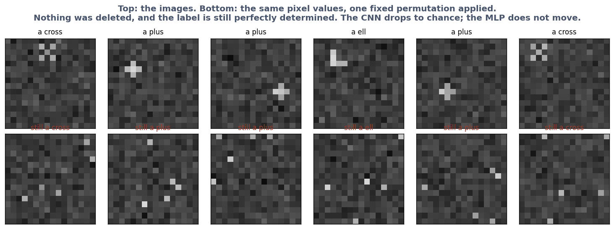

# Exercise 1 · A guess about the world

*≈ 20 min · lecture Part 1, slides 7 to 13*

## From the lecture

> **Red box 1:** *Any set of examples fits infinitely many rules; choosing one needs a preference
> not in the data, the inductive bias. How a model is wired is a guess about the world. A more
> flexible model is not a better model. The shuffle test: destroy only the thing the guess is
> about and see whether the advantage vanishes.*

## What you are doing

**In one sentence:** you will watch a small machine with a built-in guess beat a much bigger machine with no guess, and then prove that the guess was the whole reason.

Slide 7's puzzle, slide 8's race between a 700-dial model with a built-in guess and a
16,708-dial model with none, and slide 12's shuffle test.

## Run this

```python
ls.guess_the_rule()
```

**Printout A**: five rules, all fitting 1→2, 2→4, 3→6, giving different answers for 4. The
examples cannot choose; your preference for simple rules does.

```python
ls.the_race(n_train=128)          # about 10 seconds
```

```
                                                     model  parameters  train   test
CNN (assumes: nearby pixels matter, same pattern anywhere)         700  0.992  0.941
                         MLP (assumes nothing about space)       16708  1.000  0.264
```

**Table B**: the tiny model scores about 0.94 on new pictures; the big one, 24 times the dials,
scores at chance. Both are near 1.0 on what they studied.

```python
ls.shuffle_test()                 # about 30 seconds
```

```
          pixel order  CNN test  MLP test    gap
 original pixel order     0.992     0.328  0.664
      pixels shuffled     0.255     0.333 -0.078
```



**Table C**: the tiny model falls to chance; the big one does not move; the gap flips sign.

## Check these against `SUBMISSION.md`, Exercise 1

- **1a.** How many of the five rules fit the examples? *Where to look: Printout A.*
- **1b.** Test scores at 128 pictures, tiny and big. *Where to look: Table B, column `test`.*
- **1c.** Was the big model undertrained? *Where to look: Table B, column `train`.*
- **1d.** After the shuffle, the tiny model's score and the gap. *Where to look: Table C, row "pixels shuffled".*
- **1e.** What was the tiny model's advantage made of? *Where to look: Table C.*
