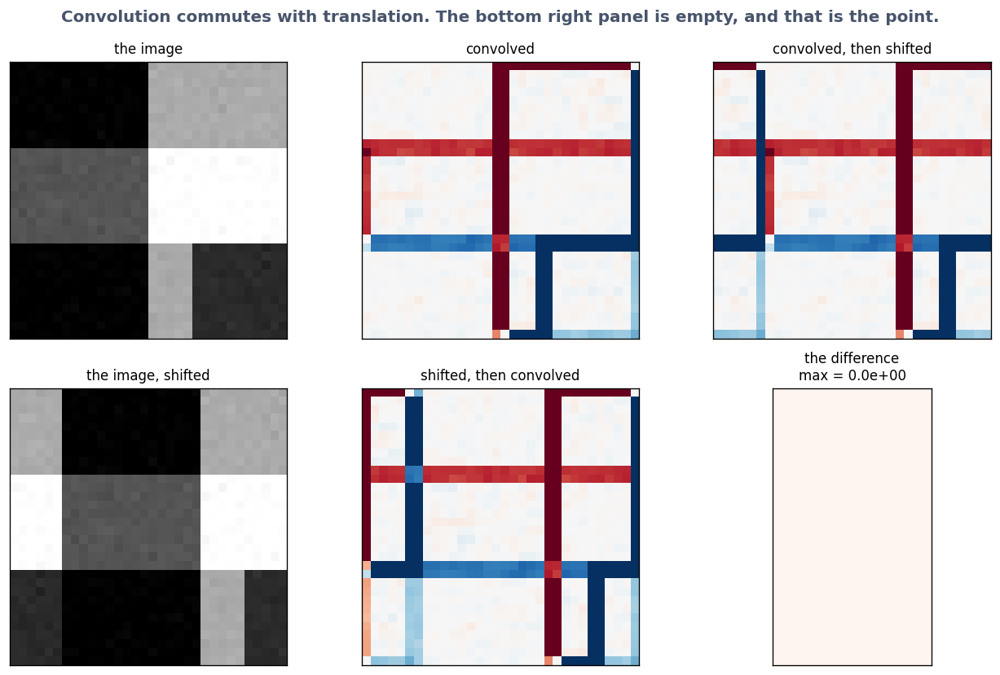

# Exercise 2 · Convolution: things near each other

*≈ 20 min · lecture Part 2, slides 14 to 20; the code on slide 18*

## From the lecture

> **Red box 2:** *A convolution slides a small square of numbers (a kernel) over the picture:
> multiply the pairs, add. The kernel does not change as it moves (weight sharing). It assumes
> locality, stationarity and compositionality. Equivariance: shift the picture and the output
> shifts the same way, exactly.*

## What you are doing

**In one sentence:** you will do a convolution by hand, watch the computer do the same thing across a whole picture, and check that moving the picture moves the answer exactly.

Slide 15's pencil calculation, slide 14's kernel walk over a small picture, slide 17's
equivariance test.

## Run this

```python
ls.by_hand()
```

```
Printout B: multiply each pair, row by row, then add everything up
  (0.1 x -1) + (0.2 x 0) + (0.9 x 1)  =  0.8
  (0.1 x -2) + (0.2 x 0) + (0.9 x 2)  =  1.6
  (0.1 x -1) + (0.2 x 0) + (0.9 x 1)  =  0.8
  total = 3.2     <- a strong response: there IS a left-to-right edge here
Printout C: ... flat patch ...: total = 0.0
Printout D: ... patch reversed ...: total = -3.2
```

```python
ls.kernel_walk()
```

A 6 × 6 picture (dark left, bright right) becomes a 4 × 4 feature map with 4s in the two middle
columns and 0s elsewhere. Big values mark *where* the edge is.

```python
ls.equivariance()
```



**Table C**: convolution 0.00e+00, dense layer 1.987.

## Check these against `SUBMISSION.md`, Exercise 2

- **2a.** The three totals. *Where to look: Printouts B, C, D.*
- **2b.** Why the flat patch gives zero. *Where to look: Printout A: the kernel sums to zero.*
- **2c.** Where the non-zero numbers are in the feature map, and what they mark. *Where to look: Table B.*
- **2d.** The two equivariance errors. *Where to look: Table C, column `value`.*
- **2e.** Why the convolution's error is exactly zero. *Where to look: red box 2.*
