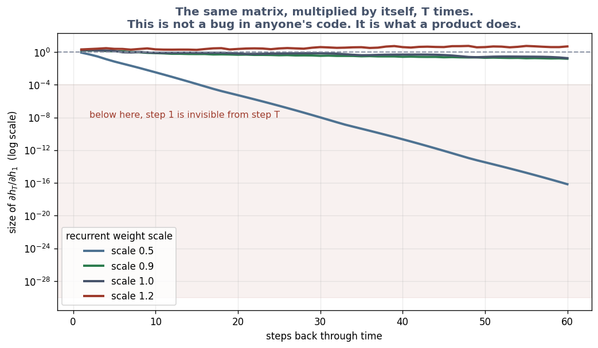

# Exercise 4 · Recurrence: one thing after another

*≈ 20 min · lecture Part 4, slides 26 to 35; the code on slide 32*

## From the lecture

> **Red box 4:** *A recurrent network is one rulebook applied at every word, updating a fixed-size
> notepad. Long chains forget because the signal is multiplied by the same number at every step.
> An LSTM's keep-gate, chosen fresh each step, lets the signal survive. Two limits remain: fixed
> notepad, one step at a time.*

## What you are doing

**In one sentence:** you will see why a reader with one rulebook forgets the start of a long sentence, and how a gate the reader controls fixes it.

## Run this

```python
ls.a_power()
```

**Printout A**: 0.9 to the sixtieth is 0.0018; 1.1 to the sixtieth is 304.

```python
ls.gradient_through_time()
```



**Table B**: at weight scale 0.5 the signal after 60 steps is 6.96e-17; at 0.9 it survives.

```python
ls.half_life()
```

**Table C**: a keep-gate of 0.95 halves the memory every 13.5 steps; 0.999 every 693.

```python
ls.memory_task()                  # about a minute
```

```
 sequence length  RNN test acc RNN grad at step 1  LSTM test acc LSTM grad at step 1
              10         1.000           1.90e-06          1.000            1.92e-08
              40         1.000           2.65e-05          0.997            5.21e-09
              90         0.463           7.81e-18          1.000            8.93e-06
```

## Check these against `SUBMISSION.md`, Exercise 4

- **4a.** 0.9 and 1.1 to the sixtieth. *Where to look: Printout A.*
- **4b.** The signal after 60 steps at scale 0.5 and 0.9. *Where to look: Table B.*
- **4c.** The half-life with keep-gate 0.95. *Where to look: Table C.*
- **4d.** At 90 steps: both scores and both signals. *Where to look: Table D, row 90.*
- **4e.** Why one signal dies and the other does not. *Where to look: red box 4.*
