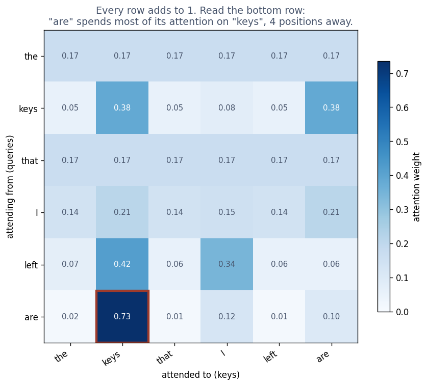

# Exercise 5 · Attention: who should talk to whom

*≈ 20 min · lecture Part 5, slides 36 to 45; the code on slide 42*

## From the lecture

> **Red box 5:** *Attention lets every word look at every other; content decides who listens to
> whom. Four steps: write three cards (query, key, value), score, share out (softmax), mix. Bare
> attention cannot see order, so position labels are added. Cost grows with the square of the
> length.*

## What you are doing

**In one sentence:** you will print the table where each word decides who to listen to, walk the four steps for one word, and show that attention cannot tell what order the words came in.

## Run this

```python
ls.soft_lookup()
```



**Table A**: row `are` puts 0.735 on `keys` (four words away) and 0.013 on `left` (next door).

```python
ls.four_instructions()
```

**Printout B**: for "are": scores (keys 4.00), shares after softmax (keys 0.73, sum 1.00), the mixed output.

```python
ls.cannot_see_order()
```

**Table C**: 8.88e-16 without position labels (rounding error); 4.192 with.

```python
ls.the_bill()
```

**Table D**: 1.1x at 64 words, 65x at 32,768; longest path always 1.

## Check these against `SUBMISSION.md`, Exercise 5

- **5a.** Row "are": shares on "keys" and "left". *Where to look: Table A.*
- **5b.** What each row sums to. *Where to look: Table A, column `sum`.*
- **5c.** The four instructions in order. *Where to look: Printout B.*
- **5d.** The two shuffle differences. *Where to look: Table C.*
- **5e.** The cost ratio and longest path at 32,768 words. *Where to look: Table D, last row.*
