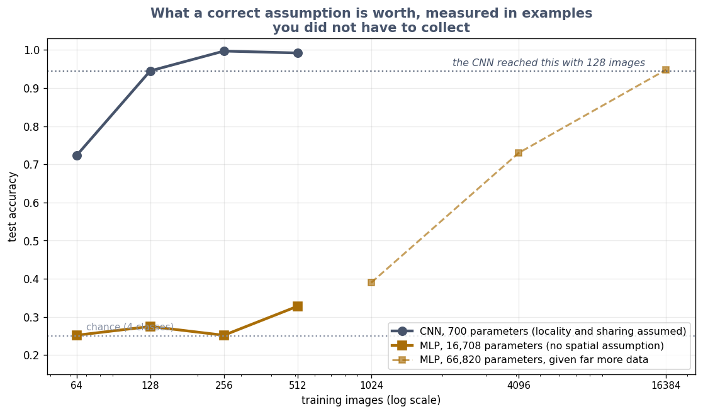

# Exercise 6 · The bargain

*≈ 20 min · lecture Part 6, slides 46 to 50*

## From the lecture

> **Red box 6:** *A true guess built into the wiring substitutes for data. Little data: the
> well-guessed machine wins. Enormous data: the machine that guesses less learns the structure
> and then wins. The Vision Transformer shows it.*

## What you are doing

**In one sentence:** you will measure the bargain from Exercise 1 at four sizes of data and see that the guess is worth more the less data you have.

## Run this

```python
ls.the_bargain()                  # about 30 seconds
```



```
 train images  CNN train  CNN test  MLP train  MLP test CNN advantage
           64      0.859     0.723        1.0     0.252     +47.2 pts
          128      0.992     0.945        1.0     0.275     +67.0 pts
          256      1.000     0.997        1.0     0.252     +74.5 pts
          512      1.000     0.992        1.0     0.328     +66.3 pts
```

```python
ls.seven_questions()
```

**Printout B**: the seven questions for anything you design.

## Check these against `SUBMISSION.md`, Exercise 6

- **6a.** The advantage at 64 and at 512 pictures. *Where to look: Table A, `CNN advantage`.*
- **6b.** The big model's training accuracy at every size. *Where to look: Table A, `MLP train`.*
- **6c.** When the bargain flips, and what flips it. *Where to look: red box 6.*
- **6d, 6e.** Which of the seven questions Exercise 1's shuffle test and Exercise 3's two endings answer. *Where to look: Printout B.*

That is the whole lab.
